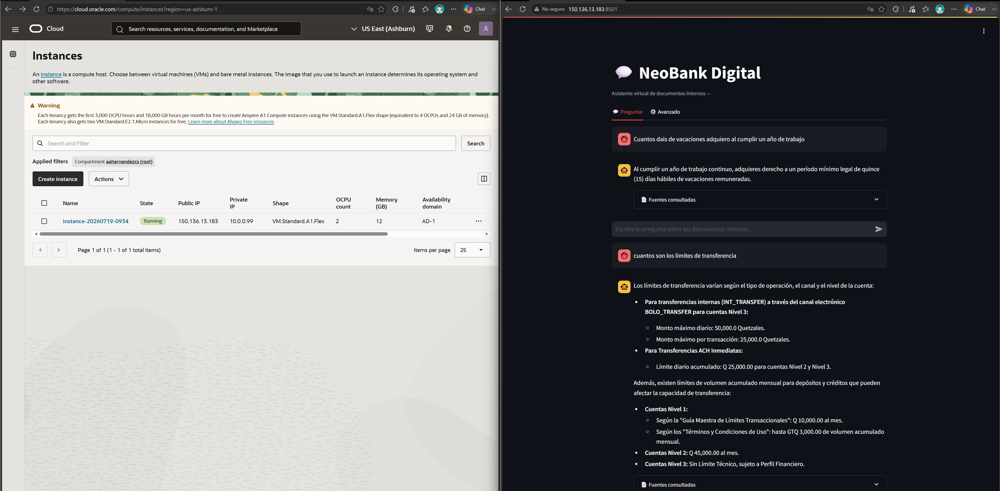
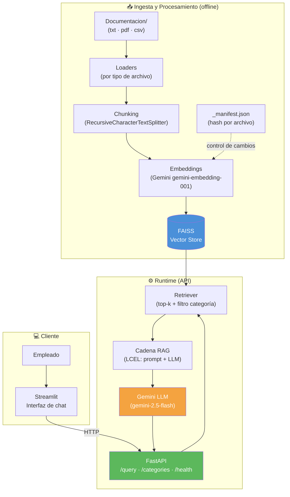

# 💬 NEOBANK DIGITAL

Agente de IA basado en RAG (*Retrieval-Augmented Generation*) que responde preguntas en lenguaje natural sobre documentos internos de la organización (políticas, procedimientos, términos y condiciones, matrices legales, etc.), expuesto como API REST y como interfaz de chat web para empleados.

Construido con **Python, LangChain, Google Gemini y FAISS**, contenedorizado con **Docker**, y desplegado en **Oracle Cloud Infrastructure (OCI Compute, Always Free tier)**.

---

## Demo: sistema desplegado y funcionando

Instancia OCI Compute (`VM.Standard.A1.Flex`, 2 OCPU / 12GB, Always Free tier) corriendo el stack completo, respondiendo preguntas reales sobre el corpus interno con sus fuentes citadas:



---

## Tabla de contenidos

- [Arquitectura](#arquitectura)
- [Stack tecnológico](#stack-tecnológico)
- [Estructura del proyecto](#estructura-del-proyecto)
- [Instalación y ejecución local (sin Docker)](#instalación-y-ejecución-local-sin-docker)
- [Ejecución con Docker Compose](#ejecución-con-docker-compose)
- [Uso de la API](#uso-de-la-api)
- [Interfaz de chat (Streamlit)](#interfaz-de-chat-streamlit)
- [Indexación de documentos](#indexación-de-documentos)
- [Variables de entorno](#variables-de-entorno)
- [Testing](#testing)
- [Despliegue en OCI](#despliegue-en-oci)
- [Troubleshooting y notas técnicas](#troubleshooting-y-notas-técnicas)
- [Decisiones de arquitectura y trabajo futuro](#decisiones-de-arquitectura-y-trabajo-futuro)

---

## Arquitectura

### Diagrama conceptual



### Flujo de datos

1. **Ingesta** (`scripts/build_index.py`): lee `Documentacion/`, extrae texto de PDF/TXT/CSV, lo fragmenta y genera embeddings con Gemini, persistiendo un índice FAISS en disco.
2. **Indexación incremental**: un manifest (`_manifest.json`) registra el hash de cada archivo fuente. Solo se re-embeben archivos nuevos o modificados — no se reprocesa el corpus completo en cada corrida.
3. **Runtime**: la API FastAPI carga el índice FAISS ya construido (no lo reconstruye), arma una cadena RAG con LangChain (LCEL) que recupera los fragmentos más relevantes y se los pasa a Gemini junto con la pregunta.
4. **Cliente**: la interfaz Streamlit consume la API vía HTTP y muestra la conversación, con las fuentes citadas por cada respuesta.

### Contenedores (Docker Compose)

| Servicio | Rol | Puerto | Arranca con `docker compose up` |
|---|---|---|---|
| `api` | Sirve la API REST (FastAPI) | `8000` (interno) | ✅ |
| `web` | Interfaz de chat (Streamlit) | `8501` (público) | ✅ |
| `indexer` | Construye/actualiza el índice FAISS | — | ❌ (bajo demanda) |

`api` y `web` comparten una red Docker interna (`alura-network`); `web` se comunica con `api` vía `http://api:8000`, no vía `localhost`.

---

## Stack tecnológico

| Categoría | Tecnología |
|---|---|
| Lenguaje | Python 3.12 |
| Framework de IA | LangChain 1.x |
| LLM | Google Gemini (`gemini-2.5-flash`) |
| Embeddings | Google Gemini (`gemini-embedding-001`) |
| Vector Store | FAISS (local, persistente en disco) |
| API | FastAPI + Uvicorn |
| Frontend | Streamlit |
| Procesamiento de documentos | PyPDF, pandas |
| Contenedores | Docker + Docker Compose (multi-stage builds, usuario no-root) |
| Infraestructura | OCI Compute (Ampere A1, Always Free tier) |
| Testing | pytest, embeddings/LLM falsos deterministas (sin gastar cuota de API) |

---

## Estructura del proyecto

```
NEOBANK-DIGITAL-IA/
├── Documentacion/                # Corpus fuente (txt/pdf/csv), versionado en Git
│   └── <categoria>/              # Subcarpetas = categorías del corpus
├── src/
│   ├── config.py                 # Configuración centralizada (.env)
│   ├── ingestion/
│   │   ├── loaders.py             # Loaders por tipo de archivo (txt/pdf/csv)
│   │   ├── pipeline.py            # Orquestador de ingesta
│   │   └── chunking.py            # Fragmentación condicional por tipo
│   ├── rag/
│   │   ├── embeddings.py          # Factory de embeddings Gemini
│   │   ├── llm.py                 # Factory del LLM Gemini
│   │   ├── manifest.py            # Detección de cambios por hash de archivo
│   │   ├── vectorstore.py         # Build / sync incremental / load de FAISS
│   │   ├── retriever.py           # Retriever con filtro por categoría
│   │   └── chain.py               # Cadena RAG completa (LCEL)
│   ├── api/
│   │   ├── main.py                # App FastAPI (lifespan, endpoints, CORS)
│   │   └── schemas.py             # Modelos Pydantic de request/response
│   └── utils/
│       └── logger.py              # Logging a consola + archivo
├── scripts/
│   └── build_index.py             # Entry point de indexación (incremental o --rebuild)
├── web/                           # Servicio Streamlit (independiente, sin LangChain)
│   ├── app.py
│   ├── requirements.txt
│   └── Dockerfile
├── tests/                         # Suite de pytest (embeddings/LLM falsos, sin red)
├── Dockerfile                     # Imagen de la API (multi-stage, usuario no-root)
├── docker-compose.yml             # Orquestación de api / web / indexer
├── requirements.txt               # Dependencias de producción
├── requirements-dev.txt           # Dependencias solo de testing
└── .env.example                   # Plantilla de variables de entorno
```

---

## Instalación y ejecución local (sin Docker)

Requisitos: Python 3.12, una API key de Google Gemini ([obtener aquí](https://aistudio.google.com/apikey), tiene capa gratuita).

```bash
# 1. Clonar el repositorio
git clone https://github.com/Abner-Hernandez/NEOBANK-DIGITAL-IA.git
cd NEOBANK-DIGITAL-IA

# 2. Crear entorno virtual
python3 -m venv venv
source venv/bin/activate   # Windows: venv\Scripts\activate

# 3. Instalar dependencias
pip install -r requirements.txt

# 4. Configurar variables de entorno
cp .env.example .env
# Edita .env y completa tu GOOGLE_API_KEY real

# 5. Construir el índice vectorial (primera vez)
python -m scripts.build_index

# 6. Levantar la API
uvicorn src.api.main:app --reload
```

La API queda disponible en `http://127.0.0.1:8000` — documentación interactiva en `http://127.0.0.1:8000/docs`.

Para correr la interfaz de Streamlit en paralelo (fuera de Docker):

```bash
cd web
pip install -r requirements.txt
API_URL=http://localhost:8000 streamlit run app.py
```

---

## Ejecución con Docker Compose

Requiere Docker y Docker Compose instalados.

```bash
# 1. Configurar .env (ver sección anterior)
cp .env.example .env   # y completar GOOGLE_API_KEY

# 2. Construir las imágenes
docker compose build

# 3. Construir el índice vectorial (servicio bajo demanda, no se levanta con "up")
docker compose run --rm indexer

# 4. Levantar la API y la interfaz web
docker compose up -d
```

- API: `http://localhost:8000`
- Interfaz de chat: `http://localhost:8501`

Para detener:

```bash
docker compose down
```

Para forzar una reconstrucción completa del índice (en vez de la incremental por defecto):

```bash
docker compose run --rm indexer python -m scripts.build_index --rebuild
```

---

## Uso de la API

### `GET /health`

Estado del servicio y si el índice cargó correctamente.

```bash
curl http://localhost:8000/health
```

### `GET /categories`

Categorías disponibles en el corpus (derivadas de las subcarpetas de `Documentacion/`).

```bash
curl http://localhost:8000/categories
```

### `POST /query`

Pregunta al agente.

```bash
curl -X POST http://localhost:8000/query \
  -H "Content-Type: application/json" \
  -d '{
    "question": "¿Cuál es la política de vacaciones?",
    "categoria": "politicas_internas",
    "k": 4
  }'
```

| Campo | Tipo | Requerido | Descripción |
|---|---|---|---|
| `question` | string | ✅ | Pregunta en lenguaje natural |
| `categoria` | string | ❌ | Restringe la búsqueda a una categoría del corpus |
| `k` | int (1-20) | ❌ (default `4`) | Cantidad de fragmentos a recuperar |

Respuesta:

```json
{
  "question": "¿Cuál es la política de vacaciones?",
  "answer": "Según los documentos, los empleados tienen 15 días de vacaciones al año...",
  "sources": [
    {
      "source": "Documentacion/politicas_internas/vacaciones.txt",
      "categoria": "politicas_internas",
      "content_snippet": "Todos los empleados tienen derecho a 15 días hábiles..."
    }
  ]
}
```

---

## Interfaz de chat (Streamlit)

La interfaz tiene dos pestañas:

- **💬 Preguntar**: experiencia simple para el empleado — sin configuración visible, busca en todo el corpus.
- **⚙️ Avanzado**: filtros opcionales (categoría, cantidad de fragmentos) para quien quiera afinar la búsqueda.

El historial de conversación persiste durante la sesión del navegador (`st.session_state`), y cada respuesta incluye un desplegable con las fuentes exactas utilizadas.

---

## Indexación de documentos

El índice FAISS **no se reconstruye automáticamente** al agregar documentos — es un paso explícito.

### Agregar o modificar un documento

```bash
# 1. Coloca el archivo en la categoría correspondiente
cp nuevo_documento.pdf Documentacion/categoria_correspondiente/

# 2. Reindexación incremental (solo embebe lo nuevo/modificado)
python -m scripts.build_index
# o con Docker:
docker compose run --rm indexer
```

### Cómo funciona la indexación incremental

- Se calcula un hash MD5 de cada archivo en `Documentacion/`.
- Se compara contra `_manifest.json` (guardado junto al índice).
- **Archivo nuevo** → se embebe.
- **Archivo modificado** (hash distinto) → se borran sus fragmentos viejos del índice y se re-embeben los nuevos.
- **Archivo sin cambios** → se omite, cero llamadas a la API de embeddings.
- **Archivo eliminado** de `Documentacion/` → sus fragmentos se eliminan del índice.

Esto evita re-embeber el corpus completo (436 fragmentos) cada vez que se agrega un documento, lo cual importa especialmente por los límites del *free tier* de Gemini.

### Resiliencia ante límites de la API (rate limiting)

La indexación procesa en lotes pequeños (10 documentos, configurable) con pausa proactiva entre lotes y reintentos con backoff exponencial ante errores `429`. Además, guarda progreso incremental en disco — si el proceso se corta a mitad de camino, la siguiente corrida retoma desde donde quedó, sin volver a gastar cuota en lo ya indexado.

---

## Variables de entorno

Ver `.env.example` para la plantilla completa. Variables principales:

| Variable | Descripción | Default |
|---|---|---|
| `GOOGLE_API_KEY` | API key de Google Gemini (**requerida**) | — |
| `GEMINI_LLM_MODEL` | Modelo de chat usado para generar respuestas | `gemini-2.5-flash` |
| `GEMINI_EMBEDDING_MODEL` | Modelo de embeddings | `models/gemini-embedding-001` |
| `RAW_DATA_DIR` | Carpeta del corpus fuente | `Documentacion` |
| `VECTORSTORE_DIR` | Carpeta de persistencia del índice FAISS | `vectorstore/faiss_index` |
| `LOG_LEVEL` | Nivel de logging | `INFO` |
| `APP_ENV` | Entorno de ejecución (`local` / `production`) | `local` |
| `ALLOWED_ORIGINS` | Orígenes permitidos por CORS, separados por coma | `*` |

> ⚠️ En producción, define `ALLOWED_ORIGINS` con el dominio real de tu app web en vez de `*`.

---

## Testing

Los tests usan embeddings y modelos de chat **falsos y deterministas** — no requieren `GOOGLE_API_KEY` real ni hacen llamadas de red, por lo que corren rápido y gratis.

```bash
pip install -r requirements-dev.txt
python -m pytest tests/ -v
```

Cobertura actual: ingesta (loaders por tipo de archivo), chunking condicional, indexación incremental (ciclo completo nuevo/sin-cambios/modificado/eliminado, incluyendo el caso de índice preexistente sin manifest), retriever con filtro por categoría, cadena RAG (LCEL), y todos los endpoints de la API.

---

## Despliegue en OCI

### Decisión de arquitectura

Se optó por **OCI Compute (VM Ampere A1, Always Free tier)** corriendo Docker Compose, en vez de OCI Container Instances u OKE (Kubernetes). Razones:

1. El cuello de botella real del sistema es el *rate limit* del *free tier* de Gemini, no la capacidad de cómputo — escalar horizontalmente el número de contenedores no aumenta el throughput real, porque el límite está en un servicio externo.
2. El *Always Free tier* de Ampere A1 provee actualmente 2 OCPU / 12 GB (reducido desde 4/24 el 15-jun-2026) — un clúster de Kubernetes consumiría una porción significativa de ese presupuesto en overhead de orquestación, sin beneficio real de autoescalado a este volumen de tráfico.
3. OCI Container Instances no está incluido en el *Always Free tier*.

Esta decisión cumple el requisito de usar al menos un servicio del ecosistema OCI (Compute), sin incurrir en complejidad ni costo innecesarios para el volumen de uso esperado (herramienta interna para empleados).

### Pasos de despliegue

1. **Crear la instancia**: Compute → Create Instance → Shape: `VM.Standard.A1.Flex` (marcada `Always Free-eligible`) → Imagen: Canonical Ubuntu 24.04 → generar y descargar el par de llaves SSH.

2. **Conectarse por SSH** e instalar Docker (método oficial, no el script de conveniencia):

   ```bash
   sudo apt-get update
   sudo apt-get install -y ca-certificates curl gnupg
   sudo install -m 0755 -d /etc/apt/keyrings
   curl -fsSL https://download.docker.com/linux/ubuntu/gpg | sudo gpg --dearmor -o /etc/apt/keyrings/docker.gpg
   sudo chmod a+r /etc/apt/keyrings/docker.gpg
   echo \
     "deb [arch=$(dpkg --print-architecture) signed-by=/etc/apt/keyrings/docker.gpg] https://download.docker.com/linux/ubuntu \
     $(. /etc/os-release && echo "$VERSION_CODENAME") stable" | \
     sudo tee /etc/apt/sources.list.d/docker.list > /dev/null
   sudo apt-get update
   sudo apt-get install -y docker-ce docker-ce-cli containerd.io docker-buildx-plugin docker-compose-plugin
   sudo usermod -aG docker $USER && newgrp docker
   ```

3. **Clonar el repositorio y configurar**:

   ```bash
   git clone https://github.com/Abner-Hernandez/NEOBANK-DIGITAL-IA.git
   cd NEOBANK-DIGITAL-IA
   cp .env.example .env
   nano .env   # completar GOOGLE_API_KEY real
   ```

4. **Corregir permisos de las carpetas montadas como volumen** (el contenedor corre como usuario no-root `uid 1000`; si Docker crea estas carpetas por primera vez lo hace como root):

   ```bash
   mkdir -p vectorstore logs
   sudo chown -R 1000:1000 vectorstore logs
   ```

5. **Construir imágenes, indexar y levantar servicios**:

   ```bash
   docker compose build
   docker compose run --rm indexer
   docker compose up -d
   ```

6. **Abrir el puerto 8501 en dos capas** (Security List de OCI y `iptables` de la VM — las imágenes Ubuntu de OCI traen `iptables` preconfigurado bloqueando todo excepto SSH por defecto):

   - **Security List** (consola OCI): Networking → VCN → subred → Security List → Add Ingress Rule: `0.0.0.0/0`, TCP, puerto `8501`.
   - **iptables** (en la VM):
     ```bash
     sudo iptables -I INPUT -p tcp --dport 8501 -j ACCEPT
     sudo netfilter-persistent save
     ```
   - **No se expone el puerto 8000** (API) públicamente — solo es accesible internamente entre contenedores.

7. **Acceder**: `http://<IP_PUBLICA_DE_LA_VM>:8501`

### Actualizar el despliegue tras cambios en el código

```bash
git pull
docker compose build --no-cache
docker compose up -d
```

### Actualizar el índice tras agregar documentos

```bash
git pull   # si el documento se agregó vía commit
docker compose run --rm indexer
```

---

## Troubleshooting y notas técnicas

### `ModuleNotFoundError: No module named 'faiss'` / `numpy.distutils` en ARM64 (Ampere A1)

**Observación (bug de compatibilidad, ya corregido en este repo):** al desplegar en una VM Ampere A1 (ARM64/`aarch64`), `faiss-cpu==1.9.0` fallaba al importar con el siguiente error de fondo:

```
ModuleNotFoundError: No module named 'numpy.distutils'
```

**Causa raíz**: no es un problema de arquitectura ARM en sí, sino de **Python 3.12**, que eliminó el módulo `distutils` de su librería estándar. `numpy.distutils` depende internamente de él. La *wheel* de `faiss-cpu==1.9.0` para `linux_aarch64` intenta detectar soporte de instrucciones SVE usando `numpy.distutils.cpuinfo`, y su versión del *loader* (de fines de 2024) no capturaba correctamente esa excepción — a diferencia de la *wheel* `x86_64` de la misma versión, que sí lo manejaba bien, lo cual inicialmente hizo parecer un problema específico de ARM.

**Solución aplicada**: actualizar `faiss-cpu` de `1.9.0` a `1.14.3` (que sí incluye el *loader* corregido para `aarch64`), manteniendo `numpy<2.0` como precaución adicional de compatibilidad. Ver el comentario correspondiente en `requirements.txt` y el issue de referencia: [facebookresearch/faiss#3936](https://github.com/facebookresearch/faiss/issues/3936).

**Lección para despliegues futuros**: al desplegar en una arquitectura de CPU distinta a la usada en desarrollo (x86_64 local → ARM64 en OCI), no asumir que "si pasó los tests localmente, va a funcionar igual en el servidor" — algunas dependencias binarias (como `faiss-cpu`) publican *wheels* independientes por arquitectura, que pueden tener bugs o quedar desactualizadas de forma distinta entre plataformas.

### `PermissionError` al escribir en `/app/vectorstore` dentro del contenedor

**Causa**: el contenedor corre como usuario no-root (`appuser`, `uid 1000`) por buenas prácticas de seguridad. Cuando Docker crea automáticamente una carpeta del host para un volumen que no existía (`./vectorstore`, `./logs`), la crea con propietario `root`, y `appuser` no tiene permiso de escritura ahí.

**Solución**: crear esas carpetas manualmente en el host y ajustar su propietario antes de levantar los contenedores:

```bash
mkdir -p vectorstore logs
sudo chown -R 1000:1000 vectorstore logs
```

### Modelos de Gemini deprecados

Durante el desarrollo, Google deprecó `text-embedding-004` (migrado a `models/gemini-embedding-001`) y `gemini-2.0-flash` (discontinuado el 1-jun-2026, migrado a `gemini-2.5-flash`). Los nombres de modelo están centralizados en variables de entorno (`GEMINI_LLM_MODEL`, `GEMINI_EMBEDDING_MODEL`) precisamente para poder actualizarlos sin tocar código si esto vuelve a ocurrir.

### Docker Compose no reconstruye una imagen a pesar de `--no-cache`

Si varios servicios comparten el mismo `Dockerfile` (como `api` e `indexer` en este proyecto), especificar el servicio explícitamente evita ambigüedades de caché entre builds:

```bash
docker compose build --no-cache indexer
docker compose build --no-cache api web
```

---

## Decisiones de arquitectura y trabajo futuro

Documentado aquí para transparencia sobre alcance y deuda técnica consciente:

- **`langchain-community` está en sunset** (archivado por LangChain el 19-jun-2026). Se sigue usando la última versión publicada (`0.4.2`, funcional y validada con tests propios) para `PyPDFLoader`, `TextLoader` y `FAISS`, a falta de reemplazos *standalone* maduros para estos tres componentes. Ver nota completa en `requirements.txt`.
- **Vector store**: se usa FAISS local en vez de Oracle Autonomous Database 23ai (que soporta búsqueda vectorial nativa y está incluido en el *Always Free tier*). Es una alternativa válida para trabajo futuro, pero se priorizó no rediseñar un componente ya validado dentro del alcance de este proyecto.
- **Secretos**: se manejan vía `.env` (excluido de Git). OCI Vault sería el endurecimiento apropiado para un entorno de producción real de largo plazo.
- **HTTPS/TLS**: no implementado en esta entrega — la herramienta es de uso interno. Un OCI Load Balancer (incluido en el *Always Free tier*) sería el siguiente paso para terminación TLS.
- **CI/CD**: pendiente de automatización completa vía GitHub Actions (tests automáticos en cada push ya definidos; despliegue automatizado a la VM queda como mejora futura).

---

## Convención de commits

Este proyecto sigue [Conventional Commits](https://www.conventionalcommits.org/): `feat:`, `fix:`, `chore:`, `test:`, `data:`, `docs:` como prefijos principales, con scope opcional entre paréntesis (ej. `feat(rag): ...`, `fix(api): ...`).
